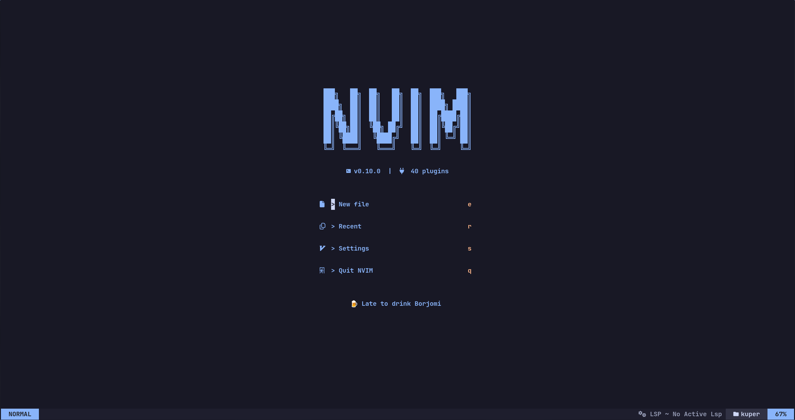
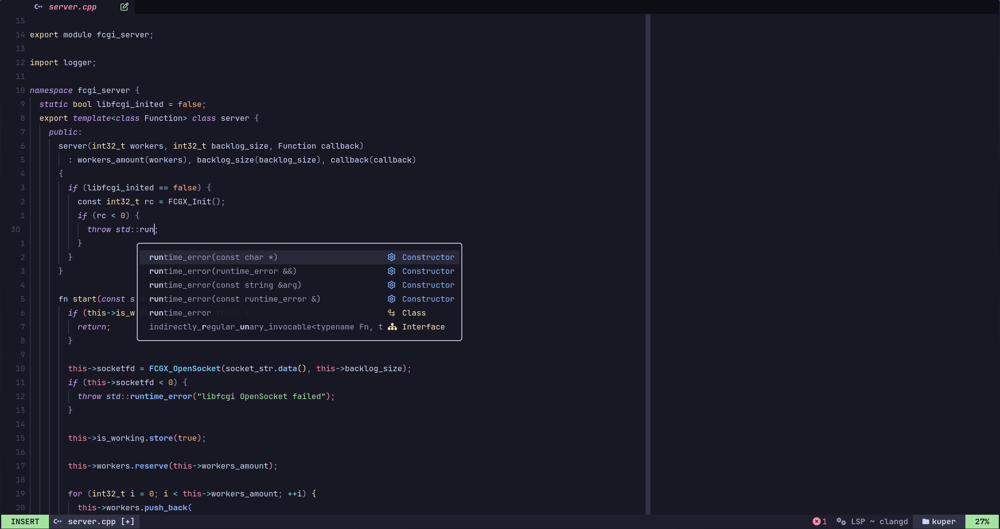
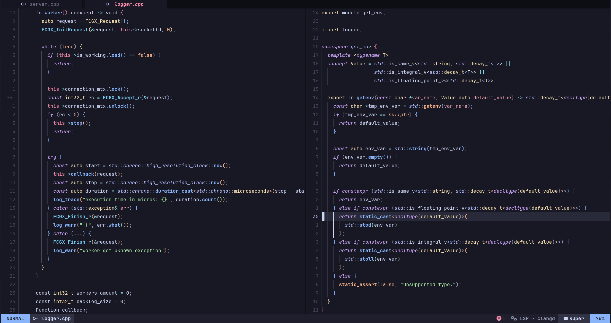

# Its Just my little config for nvim

Personal config for C++ Development







## Requirements

### Common requirements

1. [Neovim 0.10 +](https://github.com/neovim/neovim);
2. [ripgrep](https://github.com/BurntSushi/ripgrep);
3. `git`;

### Plugin dependencies

1. [NerdFonts](https://www.nerdfonts.com) for pretty icons;
2. [node](https://nodejs.org/en) for [markdown-preview.nvim](https://github.com/iamcco/markdown-preview.nvim);
3. `Clang` or `GCC` for [nvim-treesitter](https://github.com/nvim-treesitter/nvim-treesitter)

## Install

### Clone repository


```bash
 git clone https://github.com/SHTRAMPANTUNC/MyNvim ~/.config/nvim
 nvim
